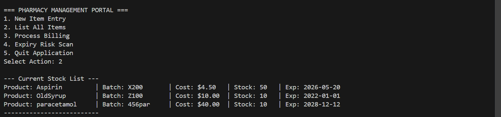

========================================================================
PROJECT TITLE: MediStock - Pharmacy Inventory & Expiry Tracker  
DOMAIN:        Healthcare / Retail Management  
LANGUAGE:      Java (JDK 8 or higher )  

## 📸 Project Screenshots

### 🔹 Item Entry & Main Menu

### 🔹 Current Stock List Display

## 1. PROBLEM STATEMENT

Small local pharmacies often face financial losses and safety risks due to 
mismanagement of medicine expiry dates. Manual paper registers make it 
difficult to track which batch is expiring soon. This project automates 
the tracking process to ensure patient safety and reduce stock wastage.

## 2. PROJECT OVERVIEW

MediStock is a Console-Based Application designed to help pharmacists 
manage their inventory efficiently. The core feature of this system is 
the "Expiry Risk Scan ," which mathematically calculates the days remaining 
for every medicine and alerts  the user about critical or near-expiry stock.

## 3. KEY FEATURES

* **Stock Management:** Add new medicines with Batch ID, Price, and Expiry Date.  
* **Billing System:** Simple text-based billing that checks stock availability  
  before confirming a sale.  
* **Expiry Alerts:** A specialized algorithm that scans all items and warns  
  about medicines expiring within 30 days.  
* **Data Persistence:** Automatically saves inventory to a local text file  
  (`pharmacy_db.txt`) so data is not lost when the application closes.

## 4. FILE STRUCTURE

The project consists of three modular Java files:

### A. `Medicine.java`
- Acts as the **Model** class.  
- Defines attributes of a medicine (Name, Batch, Price, Quantity, Expiry Date).  
- Handles date parsing and data encapsulation.

### B. `InventoryManager.java`
- The **Logic** class.  
- Contains core algorithms for:
  - Adding stock  
  - Calculating sale costs  
  - Scanning for expiry dates  
- Handles File I/O operations.

### C. `MediStockApp.java`
- The **View** class (Main Entry Point).  
- Provides a menu-driven interface for the user to interact with the system.

## 5. HOW TO RUN

**Step 1:** Ensure Java is installed on your system.  
**Step 2:** Save all three `.java` files in the same folder.  
**Step 3:** Open your terminal/command prompt in that folder.  
**Step 4:** Compile the code using:

